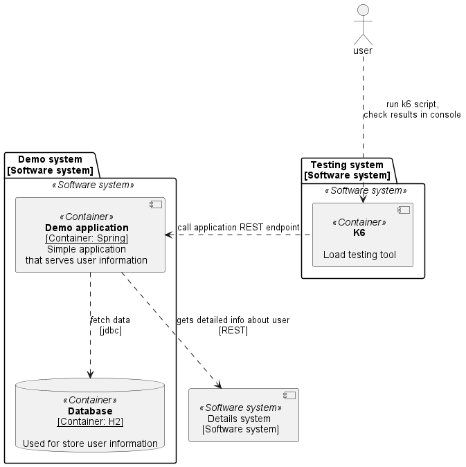
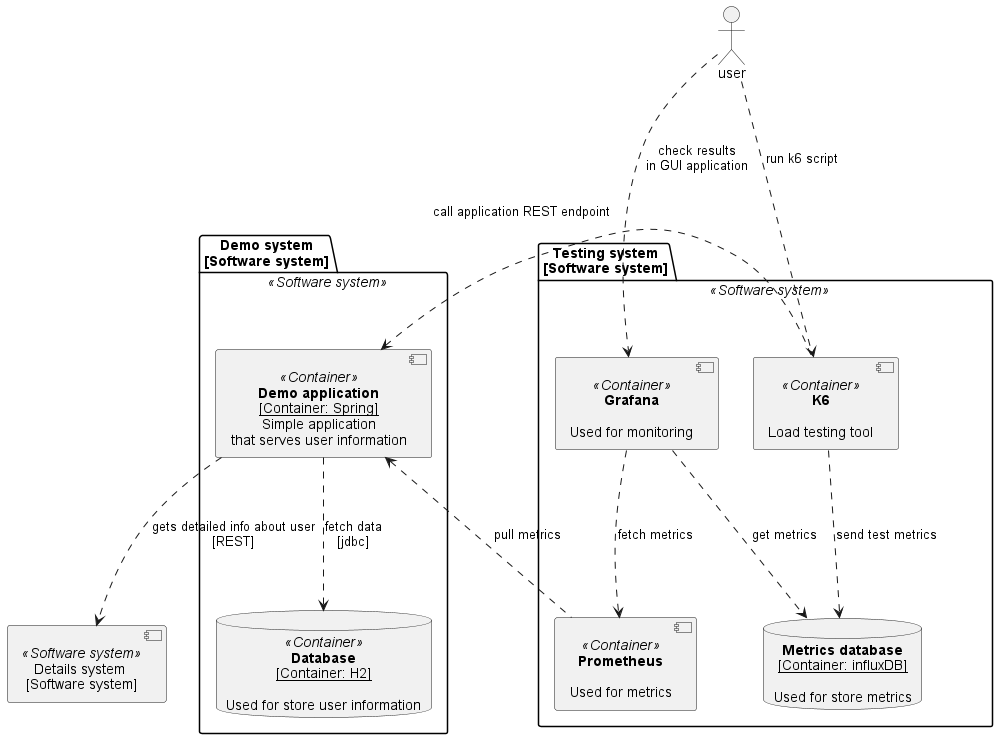
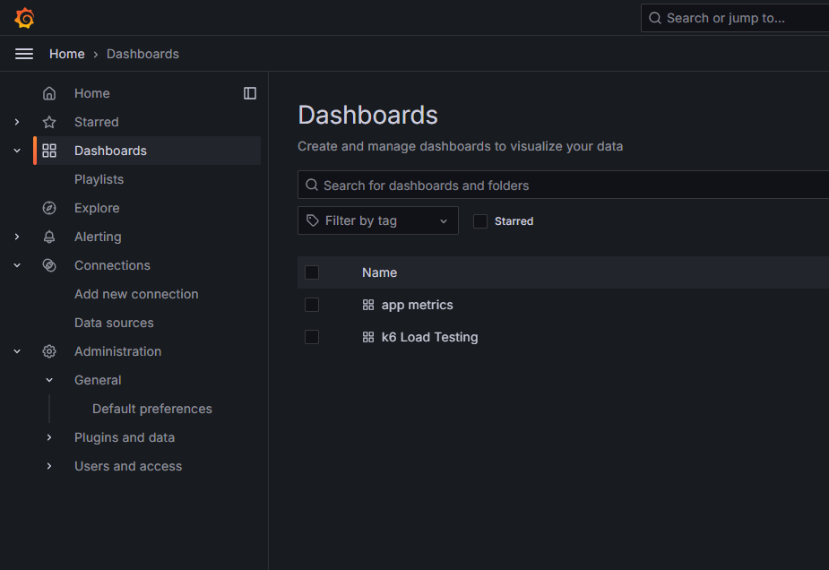
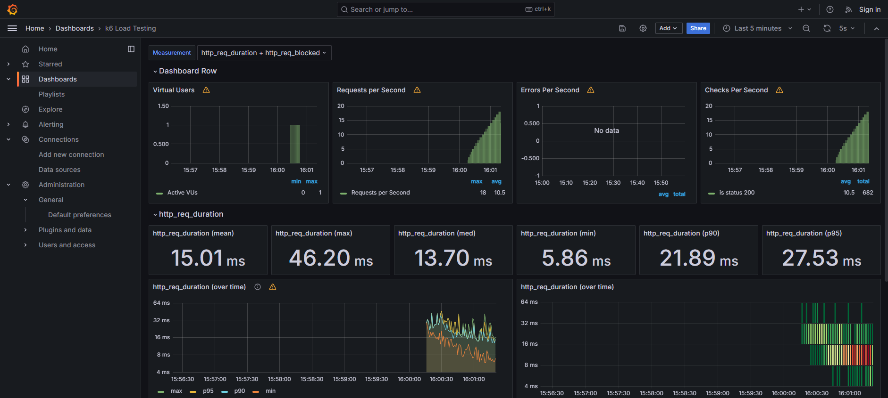
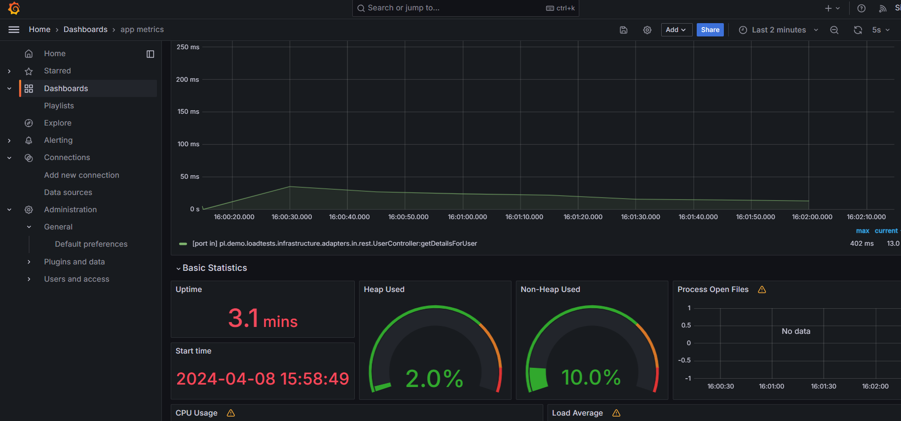
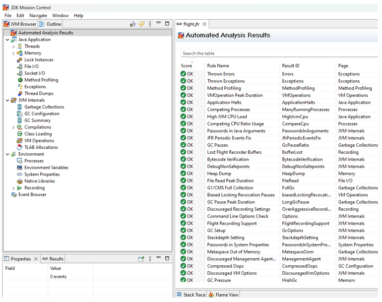

# Application


You can find source in [architecture.puml](architecture.puml)

Details system is created in Wiremock. Please check wiremock mappings in [mock/mappings](mock/mappings)

---

# How to run?

## Requirements

- any linux distribution, or Windows WSL2 with Ubuntu.
- `docker` & `docker compose` installed
- `make` installed (`sudo apt-get install make`)

## Makefile tasks organization

You can run all of commands presented in this DEMO by `make {TASK-NAME}`.

All of demos has the same convention:

1. start docker service on wsl2: `make docker-service-start`
1. start demo by: `make demo-{name-of-demo}-start-all`, for example `make demo-1-start-all`
1. run tests by: `make demo-{name-of-demo}-test*`, for example `make demo-1-test`

For more details please see [Makefile](Makefile)

---

# Demos

## Demo 1

Run app by compose ,run verifications, call simple test for 5 iterations

1. start docker service typing
```shell
make make docker-service-start
```

You should see results like:
```shell
sudo service docker start
 * Starting Docker: docker                      [ OK ]
sudo service docker status
 * Docker is running
```

2. Start application via docker compose

```shell
make demo-1-start-all
```

You should see something like:
```shell
wiremock  | 2024-04-08 12:56:15.488 Verbose logging enabled
wiremock  | 2024-04-08 12:56:16.273 Verbose logging enabled
wiremock  |
wiremock  | ██     ██ ██ ██████  ███████ ███    ███  ██████   ██████ ██   ██
wiremock  | ██     ██ ██ ██   ██ ██      ████  ████ ██    ██ ██      ██  ██
wiremock  | ██  █  ██ ██ ██████  █████   ██ ████ ██ ██    ██ ██      █████
wiremock  | ██ ███ ██ ██ ██   ██ ██      ██  ██  ██ ██    ██ ██      ██  ██
wiremock  |  ███ ███  ██ ██   ██ ███████ ██      ██  ██████   ██████ ██   ██
wiremock  |
wiremock  | ----------------------------------------------------------------
wiremock  | |               Cloud: https://wiremock.io/cloud               |
wiremock  | |                                                              |
wiremock  | |               Slack: https://slack.wiremock.org              |
wiremock  | ----------------------------------------------------------------
wiremock  |
wiremock  | version:                      3.5.2
wiremock  | port:                         8080
wiremock  | enable-browser-proxying:      false
wiremock  | disable-banner:               false
wiremock  | no-request-journal:           false
wiremock  | verbose:                      true
wiremock  |
app       | 2024-04-08 12:56:22,183 INFO  [main] o.a.j.l.DirectJDKLog: Initializing Spring embedded WebApplicationContext
app       | 2024-04-08 12:56:22,183 INFO  [main] o.s.b.w.s.c.ServletWebServerApplicationContext: Root WebApplicationContext: initialization completed in 181 ms
app       | 2024-04-08 12:56:22,213 INFO  [main] o.s.b.a.e.w.EndpointLinksResolver: Exposing 2 endpoint(s) beneath base path '/actuator'
app       | 2024-04-08 12:56:22,268 INFO  [main] o.a.j.l.DirectJDKLog: Starting ProtocolHandler ["http-nio-9000"]
app       | 2024-04-08 12:56:22,272 INFO  [main] o.s.b.w.e.t.TomcatWebServer: Tomcat started on port 9000 (http) with context path ''
app       | 2024-04-08 12:56:22,287 INFO  [main] o.s.b.StartupInfoLogger: Started LoadtestsApplication in 6.222 seconds (process running for 6.851)
```


3. verify if application works properly (health check, api call, prometheus call)

```shell
make demo-1-verification
```
Results

```shell
curl -vk "http://localhost:8080/user?user-id=user3@pm.me" -H "Content-Type: application/json" -H "Accept: application/vnd.demo.v2+json"
*   Trying 127.0.0.1:8080...
* Connected to localhost (127.0.0.1) port 8080 (#0)
> GET /user?user-id=user3@pm.me HTTP/1.1
> Host: localhost:8080
> User-Agent: curl/7.81.0
> Content-Type: application/json
> Accept: application/vnd.demo.v2+json
>
* Mark bundle as not supporting multiuse
< HTTP/1.1 200
< Content-Type: application/vnd.demo.v2+json
< Transfer-Encoding: chunked
< Date: Mon, 08 Apr 2024 13:01:07 GMT
<
* Connection #0 to host localhost left intact
{"information":"user user3@pm.me","name1":"marek","surname1":"nowak"}

-------------------------

curl -vk "http://localhost:9080/actuator/health/liveness"
*   Trying 127.0.0.1:9080...
* Connected to localhost (127.0.0.1) port 9080 (#0)
> GET /actuator/health/liveness HTTP/1.1
> Host: localhost:9080
> User-Agent: curl/7.81.0
> Accept: */*
>
* Mark bundle as not supporting multiuse
< HTTP/1.1 200
< Content-Type: application/vnd.spring-boot.actuator.v3+json
< Transfer-Encoding: chunked
< Date: Mon, 08 Apr 2024 13:01:07 GMT
<
* Connection #0 to host localhost left intact
{"status":"UP","components":{"livenessState":{"status":"UP"}}}

-------------------------

curl -vk "http://localhost:9080/actuator/prometheus"
*   Trying 127.0.0.1:9080...
* Connected to localhost (127.0.0.1) port 9080 (#0)
> GET /actuator/prometheus HTTP/1.1
> Host: localhost:9080
> User-Agent: curl/7.81.0
> Accept: */*
>
* Mark bundle as not supporting multiuse
< HTTP/1.1 200
< Content-Type: text/plain;version=0.0.4;charset=utf-8
< Content-Length: 18661
< Date: Mon, 08 Apr 2024 13:01:07 GMT
<
# HELP jvm_threads_states_threads The current number of threads
# TYPE jvm_threads_states_threads gauge
jvm_threads_states_threads{state="runnable",} 9.0
jvm_threads_states_threads{state="blocked",} 0.0
jvm_threads_states_threads{state="waiting",} 22.0
jvm_threads_states_threads{state="timed-waiting",} 7.0
jvm_threads_states_threads{state="new",} 0.0
jvm_threads_states_threads{state="terminated",} 0.0
# HELP hikaricp_connections Total connections
```

4. run tests

```shell
make demo-1-test
```

Results
```shell
k6 run tests/performance/demo-1.js

          /\      |‾‾| /‾‾/   /‾‾/
     /\  /  \     |  |/  /   /  /
    /  \/    \    |     (   /   ‾‾\
   /          \   |  |\  \ |  (‾)  |
  / __________ \  |__| \__\ \_____/ .io

     execution: local
        script: tests/performance/demo-1.js
        output: -

     scenarios: (100.00%) 1 scenario, 1 max VUs, 10m30s max duration (incl. graceful stop):
              * default: 5 iterations shared among 1 VUs (maxDuration: 10m0s, gracefulStop: 30s)


     data_received..................: 1.0 kB 16 kB/s
     data_sent......................: 680 B  10 kB/s
     http_req_blocked...............: avg=160.78µs min=2.2µs    med=2.54µs   max=794.31µs p(90)=477.64µs p(95)=635.98µs
     http_req_connecting............: avg=68.18µs  min=0s       med=0s       max=340.91µs p(90)=204.54µs p(95)=272.72µs
     http_req_duration..............: avg=12.81ms  min=10.24ms  med=12.04ms  max=17.01ms  p(90)=15.7ms   p(95)=16.36ms
       { expected_response:true }...: avg=12.81ms  min=10.24ms  med=12.04ms  max=17.01ms  p(90)=15.7ms   p(95)=16.36ms
     http_req_failed................: 0.00%  ✓ 0         ✗ 5
     http_req_receiving.............: avg=457.49µs min=158.24µs med=504.35µs max=667.22µs p(90)=642.01µs p(95)=654.61µs
     http_req_sending...............: avg=92.1µs   min=13.7µs   med=15.15µs  max=400.46µs p(90)=246.83µs p(95)=323.64µs
     http_req_tls_handshaking.......: avg=0s       min=0s       med=0s       max=0s       p(90)=0s       p(95)=0s
     http_req_waiting...............: avg=12.26ms  min=9.55ms   med=11.52ms  max=16.45ms  p(90)=15.22ms  p(95)=15.84ms
     http_reqs......................: 5      75.302286/s
     iteration_duration.............: avg=13.17ms  min=10.38ms  med=12.22ms  max=18.24ms  p(90)=16.48ms  p(95)=17.36ms
     iterations.....................: 5      75.302286/s


running (00m00.1s), 0/1 VUs, 5 complete and 0 interrupted iterations
default ✓ [======================================] 1 VUs  00m00.1s/10m0s  5/5 shared iters
```


## Demo 2

Test architecture


Please see [demo-2-docker-compose.yml](tests/performance/demo-2-docker-compose.yml) for details.

1. If docker service is not running start docker service typing
```shell
make make docker-service-start
```

2. Start application via docker compose

```shell
make demo-2-start-all
```

3. Run tests for specific scenario

```shell
make demo-2-test-1-shared_iter_scenario
	
make demo-2-test-2-per_vu_scenario
	
make demo-2-test-3-constant_vu_scenario
	
make demo-2-test-4-ramping_vu_scenario
	
make demo-2-test-5-constant_arrival_rate_scenario

make demo-2-test-6-ramping_arrival_rate_scenario
```


## Demo 3

Test architecture 


Please see [demo-3-docker-compose.yml](tests/performance/demo-3-docker-compose.yml) for details.

1. If docker service is not running start docker service typing
```shell
make make docker-service-start
```

2. Start application via docker compose

```shell
make demo-3-start-all
```

3. Run tests for specific scenario

```shell
make demo-3-test
```

Open browser and go to [Grafana Dashboard](http://localhost:3000/dashboards)


there are two defined dashboards - one for k6 metrics and one for application prometheus metrics

Results:





You can find resources in:
- [grafana resources](tests/performance/grafana)
- [prometheus resources](tests/performance/prometheus)


## Demo 4

Based on Demo 3 we can configure our application for record JFR (Java Flight Recorder) file and then use it in JMC (Java Mission Control).

You can download JMC from [here](https://www.oracle.com/java/technologies/javase/products-jmc8-downloads.html )




1. If docker service is not running start docker service typing
```shell
make make docker-service-start
```

2. Start application via docker compose

```shell
make demo-4-start-all
```

3. Run tests for specific scenario

```shell
make demo-4-test
```